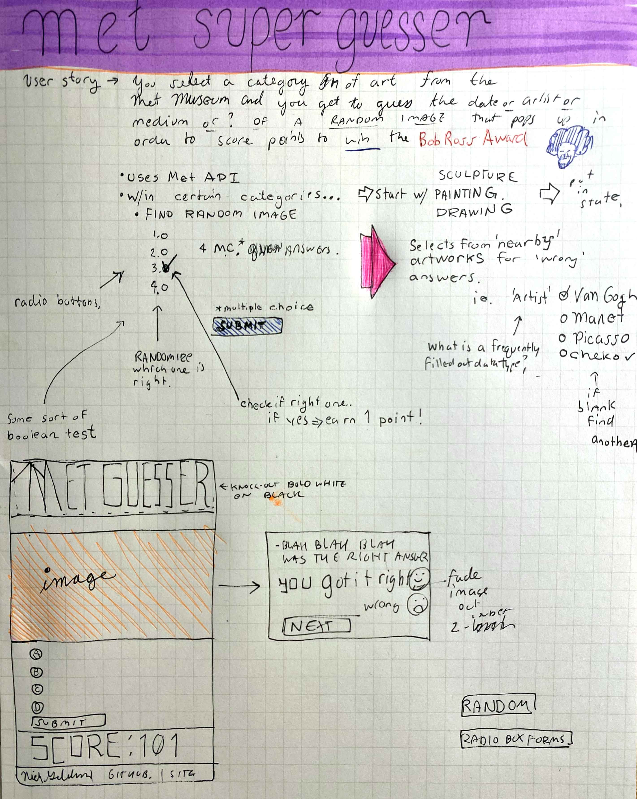

# Met Super Guesser #

Working with the Metropolitan Museum of Art API
---
You get semi-randomized multiple choice questions on art pulled from the Met to test your art knowledge. 
*Are you up for the challenge?*
Try Met Super Guesser out, it's deployed at: https://met-super-guesser-beta.netlify.app/
---

---

---
## Note from Nick
I coded this in the middle of a Fullstack Academy software engineering/web development bootcamp right after learning about APIs -- a project (very beta) that utilizes the The Metropolitan Museum of Art API. This uses Javascript, HTML and CSS.

It's a multiple choice guessing game pulling wonderfully random artworks from the Drawings and Prints, European Paintings, and Photography departments.

You guess the artist that made the artwork.

- It works by randomly choosing one of those three departments (image and artist heavy). They usually run for 13 correct guesses before switching to a new one. Or just refresh the browser.
- Then through getting all the artwork ids, it randomly selects 4 and makes sure there's actually an image associated with it.
- Why 4? To get real "wrong answers" to post along with the correct one.
- Next up randomly sorting those 4 choices with an algorithm I researched called the *Fisher Yates Algorithm*
- Then you get to make your guess.

I'm just excited to see some of the 500,000 objects in the collection take up a full screen, whether it be a watercolor painting from the 1800s of hills in North Wales, a photo that Neil Armstrong took while on the moon, or an oil painting by Rembrandt.

---
Sketchbook idea for game.

